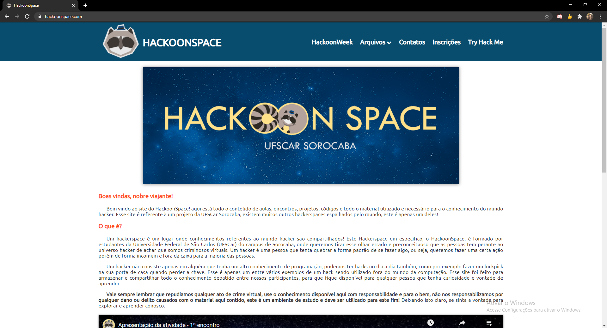
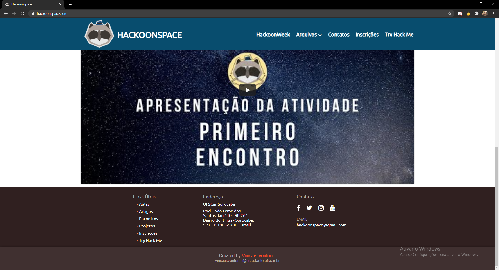
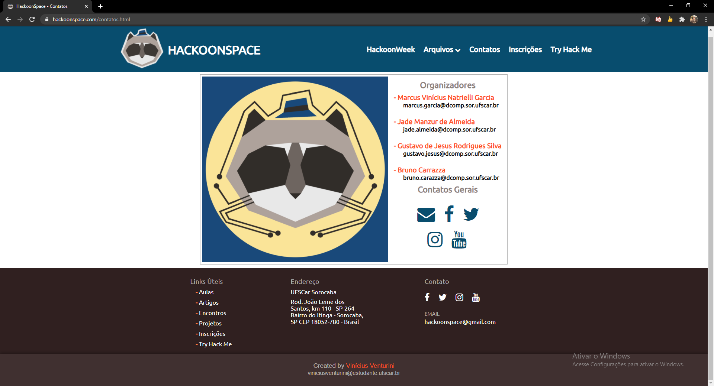
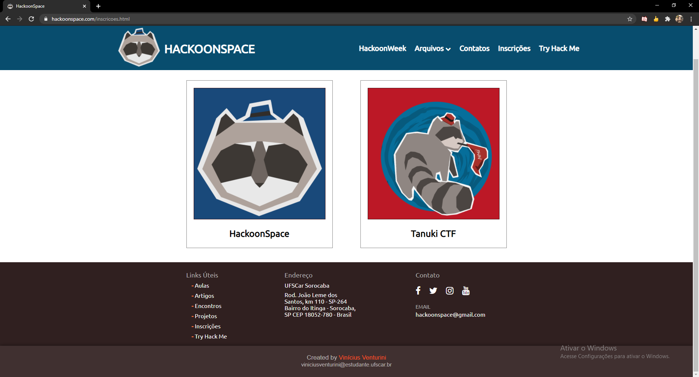

# Projeto Site Hackeável HackerSpace UFSCar 

Este projeto consiste em um site onde todo o conteúdo do HackerSpace será armazenado e, juntamente a isso, terá também uma página denominada "Try Hack Me" onde o usuário poderá tentar hackear aquela parte do site (ainda não implantado).

## Conceito do Projeto:

O projeto teve como base, ser um lugar onde o conteúdo do HackoonSpace ficasse armazenado, juntamente com ser um local onde os usuários pudessem treinar suas habilidades de hacking. O projeto foi um ótimo lugar para treino das habilidades com HTML 5 e CSS 3 e para entender quais são os perigos nos quais se deve atentar ao criar um site para que não fique vulnerável a certos tipos de ataque.

## Problemas com o projeto:

Por o projeto ter sido feito quando o autor tinha pouco conhecimento com web (principalmente no back end), o site está bem superficial com páginas apenas em HTML puro, por conta disso a página do "Try Hack Me" não foi feita, o que tende a ser alterado no futuro, com possíveis novas implementações e uma remodelagem do site para uma melhor experiência ao usuário.

## Hospedagem do site:

O site está hospedado no Domínio: https://hackoonspace.com

## Autores:

* Vinícius Carvalho Venturini (https://github.com/Vinicius-Venturini)
* Marcus Vinícius Natrieli Garcia (https://github.com/Infinitemarcus)

## Imagens:

